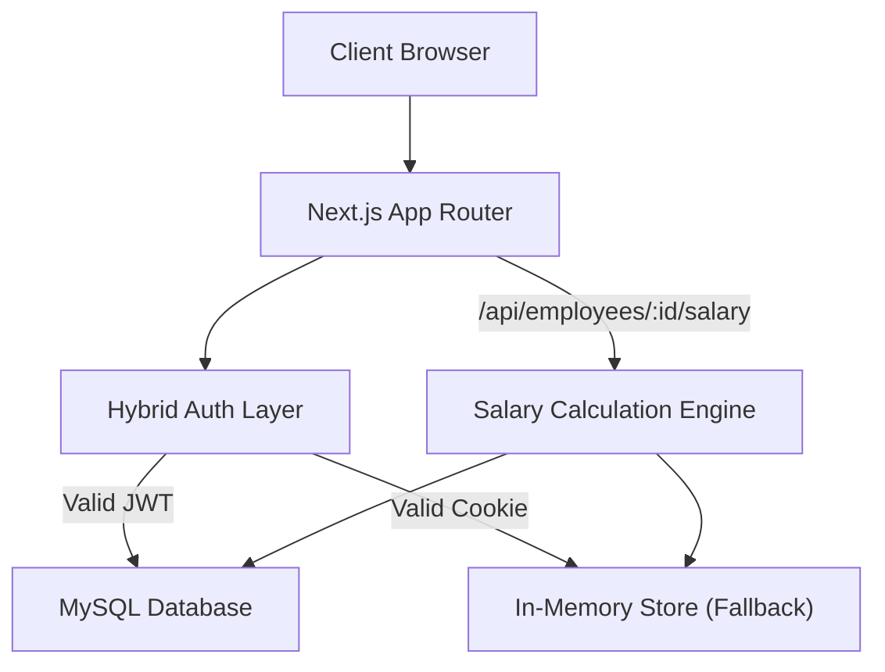

# DayFlow Architecture Document

This document outlines the technical architecture of the DayFlow HRMS application, built with **Next.js 16 (App Router)**, **Tailwind CSS v4**, and **MySQL**.

## 1. System Overview

## 2. Hybrid Authentication Layer (`src/lib/auth.ts`)
To support both robust production usage and friction-free hackathon demonstrations, the system employs a dual-authentication strategy:
1. **JWT & MySQL**: Uses `jose` to sign and verify JSON Web Tokens stored in cookies (`dayflow-session`), authenticated against the MySQL `employees` table using `bcryptjs`.
2. **Mock Cookie Fallback**: If the database is unreachable or the user logs in via the demo `/login` switcher, the app assigns a simple `dayflow_session` cookie mapped to an in-memory seed store. 

Route handlers gracefully attempt a database query first, and fall back to the mock store if it fails or if only a mock cookie is present.

## 3. The Salary Calculation Engine (`src/lib/salary-engine.ts`)
The core business logic of the application resides here. It enforces mathematical integrity for compensation data.

### Decimal-Safe Arithmetic (`src/lib/money.ts`)
Floating-point math in JavaScript can produce errors (e.g., `0.1 + 0.2 = 0.30000000000000004`). To prevent this in financial calculations, **all money values are stored and calculated in Paise (integers)**. 
- ₹50,000.00 is stored as `5000000`.
- All percentage multiplications are rounded at the integer paise level.

### Dependency Graph
The engine recalculates components in a strict order whenever the monthly wage changes:
1. `BASIC`: 50% of Total Wage
2. `HRA`: 50% of Basic
3. `STANDARD`: Fixed at ₹4,167
4. `BONUS` & `LTA`: 8.33% of Basic
5. `FIXED_ALLOWANCE`: Derived automatically (Total Wage - Sum of all above components)
6. `PF`: 12% of Basic (Deduction)
7. `PROFESSIONAL_TAX`: Fixed Deduction

## 4. Route Structure
- `(dashboard)/layout.tsx`: Authenticated wrapper providing the Sidebar.
- `api/auth/*`: Endpoints for signin, signup, logout, and `me` (current user resolution).
- `api/employees/*`: Unified REST endpoints for fetching employee directories and profiles. 
- `api/employees/[employeeId]/salary`: Secure endpoint enforcing RBAC (Role-Based Access Control). Returns `403 Forbidden` if a non-admin attempts to access another employee's salary.

## 5. Middleware Strategy
A `middleware.ts` file is included at the root. Currently, it is set to a **pass-through** state (`NextResponse.next()`) to ensure the hybrid auth architecture functions smoothly during the hackathon, while preserving the skeleton for edge-based route protection in production.
